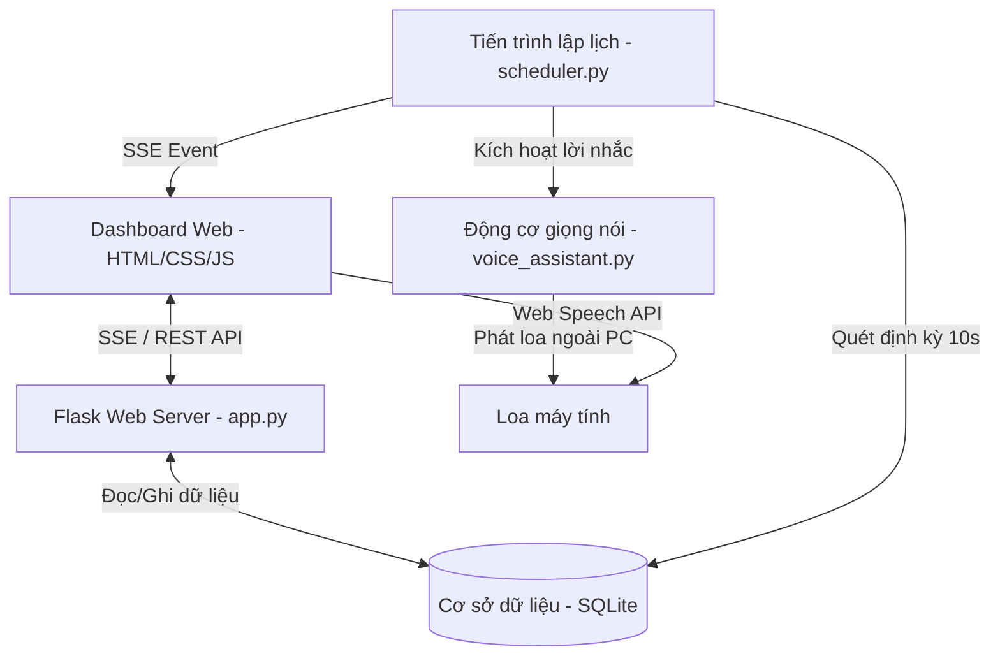

# 💊 Medi-Voice | Trợ Lý Nhắc Thuốc & Quản Lý Đơn Thuốc Thông Minh Bằng Giọng Nói

**Medi-Voice** là một ứng dụng trợ lý ảo nhắc thuốc thông minh kết hợp hoàn hảo giữa giao diện Dashboard hiện đại (phong cách Glassmorphic Neon-Dark) và hệ thống tương tác bằng giọng nói tiếng Việt. Dự án được phát triển nhằm tối ưu hóa việc quản lý và tuân thủ liều lượng uống thuốc hàng ngày của người dùng thông qua công nghệ chuyển giọng nói thành văn bản (Speech-to-Text) và lập lịch chạy ngầm tự động (Python Multi-threading Scheduler).

---

## 🌟 Các Tính Năng Nổi Bật

- 🎙️ **Điều Khiển Bằng Giọng Nói Tiếng Việt**: Nhấp vào biểu tượng Micro để ra lệnh thêm đơn thuốc hoặc xác nhận tình trạng uống thuốc tự nhiên bằng tiếng Việt.
- 📅 **Lịch Nhắc Theo Ngày & Giờ**: Hỗ trợ thiết lập lịch uống lặp lại hàng ngày hoặc lên lịch chính xác vào một ngày cụ thể trong tương lai (Ví dụ: *"ngày 20 tháng 5"*).
- 🕒 **Đồng Bộ Bù Giờ Hệ Thống (Time Offset)**: Tự động bù +5 phút toàn diện cho cả giao diện web lẫn máy chủ ngầm để đồng bộ hóa hoàn hảo trong trường hợp đồng hồ máy tính của bạn chạy chậm.
- 🔊 **Hệ Thống Âm Thanh & Giọng Nói Kép**:
  - **Trình duyệt Web (Web Speech API)**: Phát chuông cảnh báo  chói nhẹ và tự động tổng hợp giọng nói tiếng Việt chuẩn trên Dashboard.
  - **Máy chủ Python (OS Local Audio)**: Phát giọng nói trực tiếp qua loa ngoài của máy tính (sử dụng gTTS & PowerShell Native Player dự phòng), đảm bảo nhắc nhở thành công 100% kể cả khi bị chặn phát tự động trên trình duyệt.
- 📊 **Thống Kê Tuân Thủ Trực Quan**: Theo dõi phần trăm hoàn thành uống thuốc, số liều đã uống, bỏ qua và đang chờ uống theo thời gian thực.
- 🎨 **Giao Diện Glassmorphism Cao Cấp**: Thiết kế tối giản mang phong cách tương lai Cyberpunk-Dark, hiệu ứng nhấp nháy phát sáng (Pulse Neon) khi có lời nhắc kích hoạt.

---

## 🏗️ Kiến Trúc Hệ Thống



---

## 🛠️ Công Nghệ Sử Dụng

1. **Backend**: Python 3.14+ (Flask, SQLite3, Multi-threading, Regex).
2. **Frontend**: HTML5, Vanilla CSS3 (Glassmorphism), JavaScript (SSE, Fetch API, Web Speech API).
3. **Voice Engine**: 
   - **Nhận diện giọng nói**: `SpeechRecognition` (Google Speech-to-Text API tiếng Việt).
   - **Phát giọng nói**: `gTTS` (Google Text-to-Speech) phối hợp cùng Native PowerShell MediaPlayer (Windows PresentationCore) làm lớp phát âm thanh không phụ thuộc thư viện biên dịch bên ngoài.

---

## ⚙️ Hướng Dẫn Cài Đặt

### 1. Chuẩn bị môi trường
Yêu cầu máy tính cài đặt sẵn **Python 3.10+**.

### 2. Tải mã nguồn về máy
```bash
git clone https://github.com/volehoangnha123/medication-reminder-voice.git
cd medication-reminder-voice
git checkout hoangnha
```

### 3. Cài đặt các thư viện phụ thuộc
Mở PowerShell hoặc Command Prompt trong thư mục dự án và chạy:
```bash
pip install -r medication_reminder/requirements.txt
```

---

## 🚀 Hướng Dẫn Sử Dụng

### 1. Khởi chạy ứng dụng
Chạy tệp tin chạy chính của hệ thống:
```bash
python run.py
```
Hệ thống sẽ tự động khởi tạo cơ sở dữ liệu SQLite và kích hoạt **Tiến trình Lập lịch Ngầm (Scheduler Thread)**.

### 2. Truy cập Giao diện Dashboard
Mở trình duyệt web của bạn và truy cập địa chỉ:
👉 **[http://127.0.0.1:5000](http://127.0.0.1:5000)**

---

## 🎙️ Các Mẫu Câu Lệnh Giọng Nói Hỗ Trợ

Nhấp vào nút **Micro màu xanh** trên giao diện, đợi hệ thống báo *"Đang lắng nghe..."* và đọc to một trong các câu lệnh mẫu sau:

### 1. Thêm đơn thuốc mới (Lặp lại hàng ngày hoặc theo ngày cụ thể)
- *"Thêm thuốc **Aspirin** uống lúc **9 giờ sáng**"* (Mặc định lặp lại hàng ngày).
- *"Thêm thuốc **Panadol** liều lượng **1 viên** uống lúc **12 giờ**"* (Mặc định lặp lại hàng ngày).
- *"Thêm thuốc **Vitamin D3** liều lượng **2 giọt** uống lúc **20 giờ 30 phút** ngày **20 tháng 5**"* (Đặt lịch chuẩn xác theo ngày cụ thể).

### 2. Xác nhận khi có chuông báo nhắc nhở uống thuốc
Khi tới giờ hẹn, một hộp thoại màu đỏ nhấp nháy phát sáng sẽ hiện lên kèm giọng nhắc nói vang lên. Bạn có thể nhấn giữ Micro hoặc nhấn nút ghi âm và nói:
- *"Xác nhận đã uống thuốc"* hoặc *"Tôi đã uống thuốc rồi"* -> Hệ thống sẽ chuyển trạng thái sang màu xanh lục **Đã uống (TAKEN)**.
- *"Bỏ qua thuốc"* hoặc *"Tôi không uống"* -> Hệ thống sẽ chuyển trạng thái sang màu đỏ **Bỏ qua (MISSED)**.

---

## 📁 Cấu Trúc Thư Mục Dự Án

```text
medication-reminder-voice/
│
├── medication_reminder/
│   ├── static/
│   │   ├── css/
│   │   │   └── style.css            # CSS Glassmorphism giao diện tối neon
│   │   ├── js/
│   │   │   └── main.js              # Xử lý Logic client, đồng hồ bù giờ, SSE & Web Speech
│   │   └── audio/                   # Nơi lưu trữ bộ đệm giọng nói phát tiếng Việt
│   │
│   ├── templates/
│   │   └── index.html               # Cấu trúc HTML chính của Dashboard
│   │
│   ├── app.py                       # REST API Web Server (Flask) & SSE Event Hub
│   ├── database.py                  # Giao tiếp cơ sở dữ liệu SQLite & Xử lý logic bù giờ
│   ├── scheduler.py                 # Luồng giám sát thời gian thực & Kích hoạt chuông nhắc
│   ├── voice_assistant.py           # Động cơ nhận diện và tổng hợp giọng nói tiếng Việt
│   └── requirements.txt             # Danh sách thư viện cần thiết
│
├── run.py                           # Điểm kích hoạt khởi động dự án chính
├── .gitignore                       # Cấu hình bỏ qua tệp tin rác của Git
└── README.md                        # Hướng dẫn sử dụng này
```

---

## 🤝 Hướng Dẫn Đóng Góp Ý Kiến
Dự án được mở công khai (Public) dưới dạng cộng đồng! Mọi đóng góp cải tiến về thuật toán lọc từ khóa Regex, giọng nói nói tự nhiên hay các hoạt ảnh giao diện đều được nhiệt liệt chào đón. Hãy thoải mái tạo **Pull Request** hoặc gửi **Issues** nhé!

Chúc các bạn có trải nghiệm tuyệt vời cùng **Medi-Voice**! 🩺
